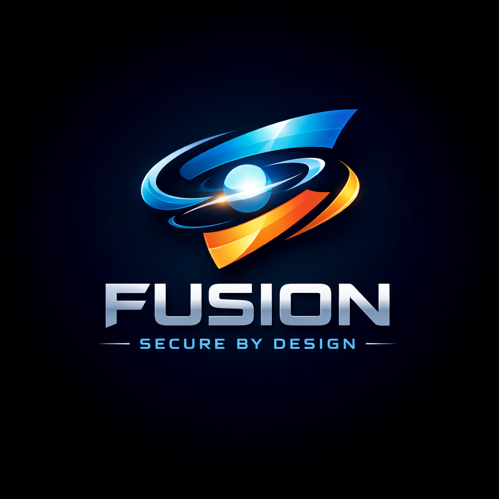
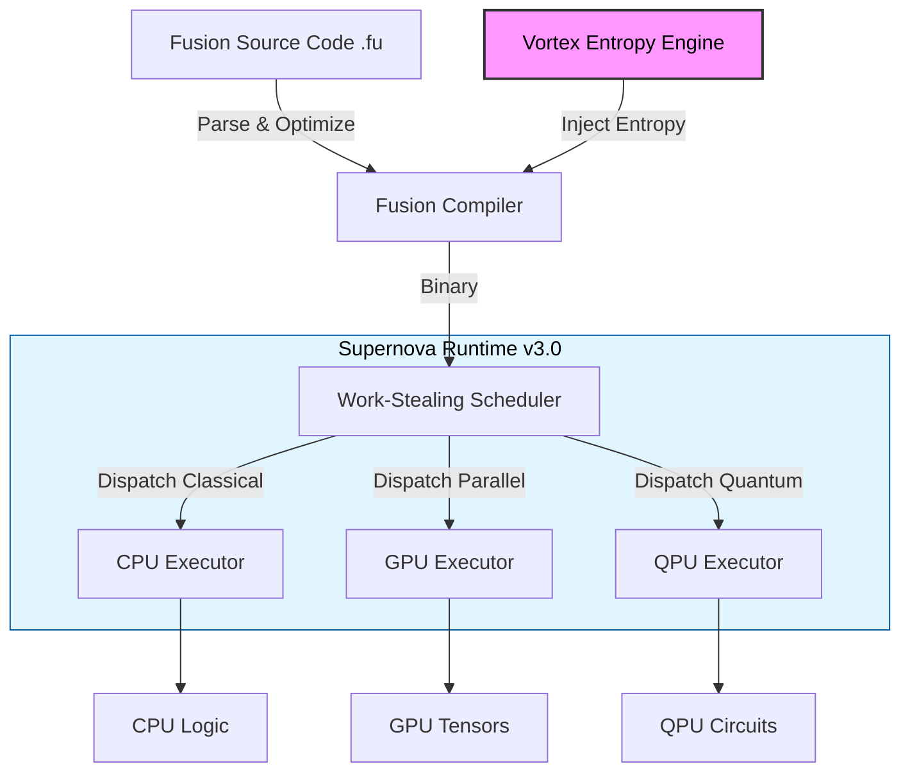

<!-- markdownlint-disable MD001 MD009 MD033 MD041 -->
<div align="center">

# Fusion v2.0 Vortex Programming Language



<br />

### The first self-hosting, quantum-native, AI-integrated systems programming language

<br />

[](LICENSE)
[](docs/DocumentIndex.md)
[](https://github.com/QuantumSecureTechnologiesInc/Fusion-Vortex)
[](docs/features/Post_Quantum_Cryptography.md)

<br />

[🚀 Quick Start](docs/guides/QuickStartGuide.md) • [📖 Feature Index](docs/features/FEATURES_INDEX.md) • [✨ Vortex Engine](docs/features/Post_Quantum_Cryptography.md) • [📚 Documentation](docs/DocumentIndex.md)

</div>

<hr />

## Overview

**Fusion v2.0 Vortex** is a modern, general-purpose systems programming language designed for the post-quantum era. It abandons legacy paradigms to offer a "secure-by-design" foundation where **Post-Quantum Cryptography (PQC)**, **AI/ML primitives**, and **Quantum Computing** support are first-class citizens, not external libraries.

The language is built on the **Vortex Engine**, a native chaotic entropy generator that ensures all cryptographic operations are resistant to quantum decryption attacks.

## What Can Fusion Do?

Fusion is more than just a language; it's a complete ecosystem for next-gen development.

- **Generative Development**: Use the **Visual Compiler** to turn natural language prompts (`"Create a REST API..."`) into compile-ready project structures.
- **Polyglot Engineering**: The **Fusion Forge** build system manages dependencies across Rust, C++, Python, and JavaScript seamlessly.
- **Web Everywhere**: Compile natively to **WebAssembly (WASM)** for high-performance browser applications with full DOM access.
- **Zero-Trust Networking**: Built-in HTTP/3 and gRPC servers with mandatory PQC-enabled TLS 1.3.

## Key Features

### 🛡️ Self-Hosting Compiler

Fusion v2.0 Vortex features a **self-hosting compiler** written entirely in Fusion (`.fu` files), demonstrating the language's maturity and capability.

### 🛡️ Native Post-Quantum Security

Fusion is the first language to integrate a **NIST-standardized PQC stack** (Kyber/ML-KEM, Dilithium/ML-DSA) directly into the standard library.

- **Vortex Entropy Engine**: High-throughput, self-healing entropy generation (`src/stdlib/vortex.fu`).
- **Zero-Trust Networking**: TLS 1.3+ with mandatory PQC cipher suites.

### 🧠 Embedded AI Primitives

Deep learning is woven into the fabric of the language.

- **First-Class Tensors**: Manipulate N-dimensional arrays as easily as integers.
- **Neural Runtime**: Built-in support for model inference (LLMs, CNNs) without Python dependencies.
- **Visual Compiler**: Generate production code from natural language intents.

### ⚛️ Hybrid Quantum Computing

Write code that spans classical and quantum paradigms.

- **Qubits as Types**: Define quantum circuits using native syntax.
- **Supernova Runtime**: Automatically dispatches kernels to the optimal hardware (CPU, GPU, or QPU).

### ⚡ Performance & Safety

- **Native compilation** via `fusion` compiler.
- **Memory Safety** without a garbage collector (ownership + borrow checker).
- **Heterogeneous Execution**: Seamless CUDA/Metal/Vulkan interoperability.

## System Architecture

The Fusion toolchain orchestrates a complex flow from high-level intent to hardware execution, powered by the **Supernova Tribrid Runtime**.



### Execution Flow

1.  **Entropy Injection**: The **Vortex Engine** infuses initial chaotic state during compilation for PQC key generation and ASLR protection.
2.  **Compilation**: Validates quantum circuits and tensor shapes at compile-time.
3.  **Supernova Dispatch**: The runtime analyzes execution paths to route workloads:
    - **CPU**: General logic, I/O, networking.
    - **GPU**: Matrix multiplications, neural network inference.
    - **QPU**: Quantum gates, entanglement operations (or simulation if hardware is unavailable).

## Example

```fusion
use std::vortex;
use std::quantum;

#[fusion::main]
fn main() -> Result<()> {
    // 1. Initialize PQC Entropy
    let ctx = vortex::VortexContext::new()?;
    let seed = ctx.generate_seed_safe()?;

    // 2. Define a Quantum Circuit
    let q = quantum::Qubit::new();
    q.hadamard();
    let result = q.measure();

    println!("Quantum Result: {}", result);

    // 3. AI Inference
    let tensor = [1.0, 2.0, 3.0].to_tensor();
    let prediction = model::predict(tensor).await?;

    Ok(())
}
```

## Getting Started

### Installation

```bash
# Clone the repository
git clone https://github.com/QuantumSecureTechnologiesInc/Fusion-Vortex.git
cd Fusion-Vortex

# Windows native bootstrap + package
powershell -ExecutionPolicy Bypass -File scripts/bootstrap_native.ps1

# Self-host readiness audit (compiler source compatibility report)
powershell -ExecutionPolicy Bypass -File scripts/audit_selfhost_readiness.ps1

# Linux/macOS native bootstrap
./scripts/native_build.sh
```

Native bootstrap outputs:

- Compiler: `target/release/fuc.exe` (Windows) or `target/release/fuc` (POSIX)
- Bin copy: `bin/fuc.exe` or `bin/fuc`
- Regression report: `artifacts/native-regression/regression_summary.txt`
- Package zip: `artifacts/packages/Fusion-native-windows-x64-<timestamp>.zip`

Native compiler safety default:

- Unresolved call symbols now fail code generation by default.
- Strict unresolved-call mode is always on in native flows.

### Creating a Project

```bash
fusion new my_project
cd my_project
fusion run
```

## Documentation

- **[Feature Index](docs/features/FEATURES_INDEX.md)**: Explore the unique capabilities of Fusion v2.0.
- **[Standard Library](docs/book/appendix-b-stdlib.md)**: API reference for `std`.
- **[Fusion Story](docs/Fusion_Story_and_Features.md)**: The philosophy behind the language.

## License

Dual-licensed under MIT and Apache 2.0.
