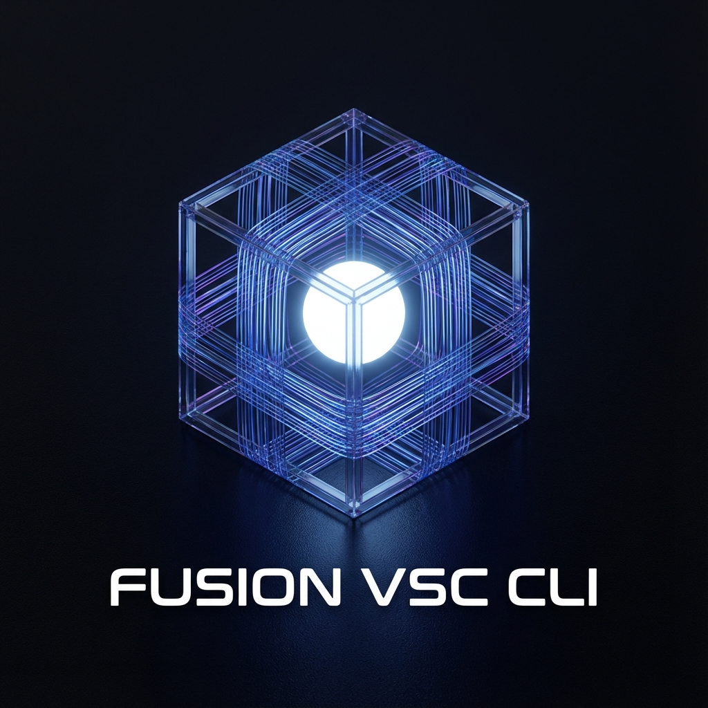
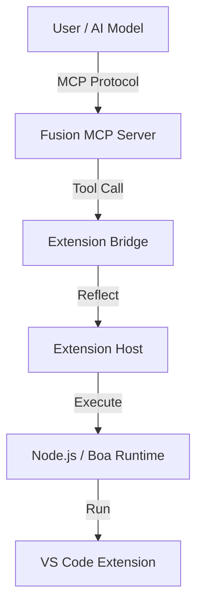

<div align="center">

# Fusion Substrate



<br />

### Enterprise-grade execution substrate with protocol locking, deterministic replay, trusted execution, and agent orchestration.

<br />

[](LICENSE)
[](https://www.rust-lang.org/)
[](https://github.com/fusion-lang/fusion-substrate)
[](https://modelcontextprotocol.io)
[](docs/security/)

<br />

[🚀 Quick Start](docs/guides/QuickStartGuide.md) • [✨ Features](#key-features) • [🏛️ Architecture](docs/design/Architecture.md) • [📚 Documentation](docs/DocumentIndex.md)

</div>

<hr />

## Overview

**Fusion Substrate** is the production-hardened execution substrate for the Fusion ecosystem. Built on four foundational pillars:

1.  **Protocol Lock**: MCP 1.0 specification with guaranteed backward compatibility
2.  **Runtime Hardening**: Crash-only execution with deterministic replay
3.  **Agent Execution**: Durable, cost-aware agent orchestration with explainability
4.  **Trusted Execution**: TEE integration, zero-knowledge proofs, and blockchain anchoring

## Key Features

### Phase 1: Protocol Lock + Runtime Hardening
*   **🔒 Locked MCP Protocol**: v1.0 specification never breaks backward compatibility
*   **📜 Deterministic Ledger**: Append-only execution log with crash-safe replay
*   **🛡️ Policy Enforcement**: Zero implicit permissions with exhaustive pre-execution validation
*   **♻️ Crash-Only Runtime**: No recovery logic—restart equals deterministic state reconstruction

### Phase 2: Agent Execution Layer
*   **🤖 Agent Orchestration**: Plan-based execution with explainable rationale at every step
*   **💰 Cost Budgeting**: Hard resource limits enforced at runtime, not advisory
*   **🔄 Multi-Agent Coordination**: Shared tool tracking and resource allocation
*   **📊 State Machine Execution**: Idle → Running → Paused → Completed with cursor-based resumption

### Phase 3: Fusion-Native Ecosystem
*   **📋 Task Graphs**: Dependency-aware task execution with concurrent boundaries
*   **👁️ File System Watching**: Live code monitoring with debounced incremental builds
*   **🔌 Plugin Architecture**: WASM-based sandboxed extensions with controlled lifecycle
*   **🔍 Code Reflection**: Zero-cost AST parsing, symbol lookup, and type inference

### Phase 4: Trusted Execution Runtime
*   **🔐 TEE Integration**: Enclave-based execution with remote attestation and sealed storage
*   **✅ Zero-Knowledge Proofs**: Tamper-evident execution logs verifiable without re-execution
*   **⛓️ Blockchain Anchoring**: Immutable audit trails with distributed consensus
*   **📋 Compliance Engine**: GDPR, SOC2, HIPAA enforcement with automated reporting

## Architecture

The CLI acts as the central hub:



## Quick Start

### Installation

```bash
# Clone the repository
git clone https://github.com/fusion-lang/fusion-vsc-cli.git

# Build the CLI
cargo build --release -p fusion

# Add to PATH
export PATH="$PATH:$(pwd)/target/release"
```

### Usage

**Start the MCP Server:**
```bash
fusion mcp serve --port 3000
```

**Run an AI Assistant Session:**
```bash
fusion ai assist
```

## Documentation

*   [Quick Start Guide](docs/guides/QuickStartGuide.md)
*   [Developer Guide](docs/guides/DeveloperGuide.md)
*   [Architecture](docs/design/Architecture.md)

## Status

**Current Version**: 0.2.0 (Bridge Connected)

*   ✅ **Bridge**: Fully Operational (Stub removed)
*   ✅ **Host**: In-Memory Command Registry Active
*   ✅ **AI**: Streaming & Tool Use Enabled

## License

Dual-licensed under MIT and Apache 2.0.
