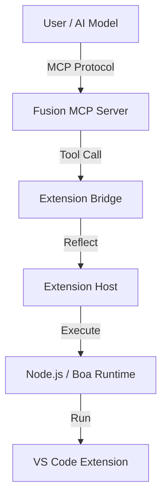

<div align="center">

# Fusion VSC CLI


<br />

### The unified bridge connecting the Fusion programming language, VS Code Extensions, and the Model Context Protocol (MCP).

<br />

[](LICENSE)
[](https://www.rust-lang.org/)
[](https://github.com/fusion-lang/fusion-vsc-cli)
[](https://modelcontextprotocol.io)

<br />

[🚀 Quick Start](docs/guides/QuickStartGuide.md) • [✨ Features](#key-features) • [🏛️ Architecture](docs/design/Architecture.md) • [📚 Documentation](docs/DocumentIndex.md)

</div>

<hr />

## Overview

**Fusion VSC CLI** is the specialized interface for the Fusion ecosystem, designed to power the IDE experience. It bridges the gap between:
1.  **Fusion Core**: The language compiler and secure runtime.
2.  **VS Code**: Via a dedicated Runtime Bridge that allows extensions to execute in a sandboxed, CLI-controlled environment.
3.  **MCP (Model Context Protocol)**: Exposing AI capabilities and context to external models and tools.

## Key Features

*   **🔌 VS Code <-> MCP Bridge**: Seamless routing of tool execution requests from AI models to VS Code extensions.
*   **🦀 Rust-Based Extension Host**: High-performance, secure runtime for executing extension logic (`fusion-vscode-runtime`).
*   **🤖 Advanced AI Integration**: Built-in support for OpenAI, Anthropic, and Local models via `fusion-ai-core`.
*   **🛡️ Post-Quantum Security**: Native PQC signing and verification for all artifacts.

## Architecture

The CLI acts as the central hub:



## Quick Start

### Installation

```bash
# Clone the repository
git clone https://github.com/fusion-lang/fusion-vsc-cli.git

# Build the CLI
cargo build --release -p fusion

# Add to PATH
export PATH="$PATH:$(pwd)/target/release"
```

### Usage

**Start the MCP Server:**
```bash
fusion mcp serve --port 3000
```

**Run an AI Assistant Session:**
```bash
fusion ai assist
```

## Documentation

*   [Quick Start Guide](docs/guides/QuickStartGuide.md)
*   [Developer Guide](docs/guides/DeveloperGuide.md)
*   [Architecture](docs/design/Architecture.md)

## Status

**Current Version**: 0.2.0 (Bridge Connected)

*   ✅ **Bridge**: Fully Operational (Stub removed)
*   ✅ **Host**: In-Memory Command Registry Active
*   ✅ **AI**: Streaming & Tool Use Enabled

## License

Dual-licensed under MIT and Apache 2.0.
