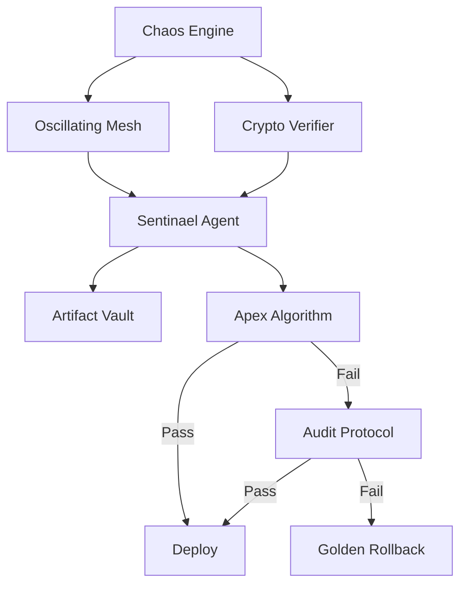

# Sentinel Tri-Brid

> **Autonomous update agent with chaos-enhanced security mesh**

## Overview

Sentinael Tri-Brid is a military-grade autonomous agent that protects software supply chains using chaos theory and moving target defence (MTD). It provides zero-touch security for critical infrastructure.

## Features

### 🔮 Chaos Math Engine
- Deterministic entropy source using logistic maps (r=3.999)
- High-entropy key material generation
- Unpredictable cryptographic operations

### 🌀 Oscillating Security Mesh
- Moving Target Defence (MTD) with dynamic access vectors
- Time-based security oscillation (default: 5-second intervals)
- Three security states: Secure, Shifting, Locked

### 🔐 Chaos-Enhanced Cryptography
- HMAC-SHA512 with chaos-seeded keys
- State-evolving signatures
- Prevents AI-driven pattern analysis

### 🛡️ Tri-Brid Red undancy
Three-tier fallback system ensures operational resilience:

1. **Apex** (Speed): Fast heuristic update engine
2. **Audit** (Safety): Double-blind verification protocol  
3. **Golden** (Resilience): Immutable rollback mechanism

## Quick Start

```rust
use sentinel_tribrid::SentinelAgent;

// Create and initialize agent
let agent = SentinelAgent::new("vault.json")?;
agent.initialize()?;

// Monitor a crate
agent.monitor_and_optimize("my_crate", false)?;
```

## CLI Usage

### Initialize Vault

```bash
fusion sentinel init
```

Creates `sentinel_vault.json` and registers core components.

### Start Monitoring

```bash
fusion sentinel monitor
```

Launches the autonomous agent in monitoring mode.

### Test Fallback Systems

```bash
fusion sentinel monitor --test-fail
```

Simulates Apex algorithm failure to test the Audit → Golden fallback chain.

## Architecture



## Security Model

### Moving Target Defence

The Oscillating Mesh shifts entry vectors every 5 seconds based on chaotic attractors. This makes the attack surface unpredictable:

```
Vector Range: 8000-9000 (dynamically generated)
Shift Interval: 5 seconds (configurable)
Validation: Exact match required
```

### Chaos-Enhanced HMAC

Traditional HMAC uses static keys. Sentinael uses chaos-seeded keys that evolve with each operation:

```rust
// Each signature advances the chaos state
let sig1 = crypto.sign(data)?;  // State: x₁
let sig2 = crypto.sign(data)?;  // State: x₂
assert_ne!(sig1, sig2);          // Signatures differ!
```

## Integration

### With Fusion Runtime

The agent uses `fusion_runtime_core` for async operations:

```rust
use fusion_runtime_core::Runtime;

let runtime = Runtime::new();
runtime.block_on(async {
    agent.monitor_and_optimize("crate", false).await?;
});
```

### With Policy Enforcement

Can be integrated with `fusion-policy` for capability-based security.

## Performance

- **Startup Time**: < 100ms
- **CPU Usage** (idle): < 1%
- **Memory**: 50MB idle, 500MB+ during compilation
- **Concurrent Monitoring**: 1000+ crates on dual-core VPS

## Cryptographic Specifications

| Component | Algorithm    | Key Size |
| --------- | ------------ | -------- |
| Hash      | SHA-512      | 512 bits |
| HMAC      | HMAC-SHA512  | 512 bits |
| Entropy   | Logistic Map | N/A      |

## License

MIT License - See LICENSE file for details

## Contributing

This crate is part of the Fusion Programming Language project. Contributions are welcome!

## Security Considerations

⚠️ **Production Use**: The chaos-enhanced cryptography is deterministic and suitable for self-verification scenarios. For networked verification, implement chaos state synchronization protocols.

⚠️ **Entropy Quality**: The logistic map provides high-quality pseudorandom numbers but is deterministic. For true randomness, use OS-level entropy sources.

## References

- [Fusion Programming Language](https://github.com/QuantumSecureTechnologiesInc/Fusion-Programming-Language)
- [Moving Target Defence (MTD)](https://en.wikipedia.org/wiki/Moving_target_defense)
- [Logistic Map Chaos](https://en.wikipedia.org/wiki/Logistic_map)
